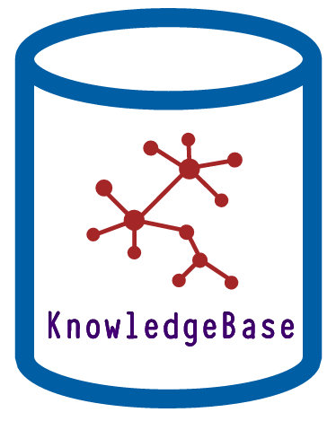

KnowledgeBase
=============

.. image:: https://img.shields.io/pypi/l/knowledgebase.svg?style=flat-square
   :target: https://pypi.python.org/pypi/knowledgebase/
   :alt: License

.. image:: https://img.shields.io/pypi/status/knowledgebase.svg?style=flat-square
   :target: https://pypi.python.org/pypi/knowledgebase/
   :alt: Development Status

.. image:: https://img.shields.io/pypi/v/knowledgebase.svg?style=flat-square
   :target: https://pypi.python.org/pypi/knowledgebase/
   :alt: Latest release

.. image:: https://img.shields.io/pypi/pyversions/knowledgebase.svg?style=flat-square
   :target: https://pypi.python.org/pypi/knowledgebase/
   :alt: Supported Python versions

.. image:: https://img.shields.io/pypi/implementation/knowledgebase.svg?style=flat-square
   :target: https://pypi.python.org/pypi/knowledgebase/
   :alt: Supported Python implementations

.. image:: https://img.shields.io/pypi/wheel/knowledgebase.svg?style=flat-square
   :target: https://pypi.python.org/pypi/knowledgebase
   :alt: Download format

.. image:: https://travis-ci.org/linkdd/knowledgebase.svg?branch=master&style=flat-square
   :target: https://travis-ci.org/linkdd/knowledgebase
   :alt: Build status

.. image:: https://coveralls.io/repos/github/linkdd/knowledgebase/badge.svg?style=flat-square
   :target: https://coveralls.io/r/linkdd/knowledgebase
   :alt: Code test coverage

.. image:: https://img.shields.io/pypi/dm/knowledgebase.svg?style=flat-square
   :target: https://pypi.python.org/pypi/knowledgebase/
   :alt: Downloads

.. image:: https://landscape.io/github/linkdd/knowledgebase/master/landscape.svg?style=flat-square
   :target: https://landscape.io/github/linkdd/knowledgebase/master
   :alt: Code Health

**KnowledgeBase** aims to become an alternative to the wiki as a solution to organize
informations.

Installation
------------

.. code-block:: text

   pip install knowledgebase

Usage
-----

.. code-block:: text

   python -m knowledgebase.wsgi
   python -m knowledgebase.wsgi -H 0.0.0.0 -p 8080

Features
--------

 - informations are organized in a graph model:
    - vertices represent the information itself
    - edges represent connections between informations
 - graph visualization
 - per knowledge permissions:
    - knowledge (be it vertices or edges) is shared publicly, with users, or with groups
 - searching using graph algorithms
 - each vertex and edge have properties that can be used for searching
 - vertices can store any kind of data:
    - textual content
    - JSON
    - files (images, videos, KeePass database, ...)
    - Hypertext links
    - ...
 - notifications:
    - a user can subscribe using filters on vertices and edges
    - when knowledge matching filters is added/read/updated/deleted, the user gets notified
    - the user can select which actions (add, read, update, deletion) he subscribe to

Technical Overview
------------------

Because all informations are stored in a graph model, this project provides a Python
interface to access Graph Database.

Currently, the only database backend is with MongoDB, but TinkerPop and Neo4J backends
will be developed soon.

Status
------

 - Graph REST API : 80%
 - Web UI : 0%
 - test coverage: 0%
 - documentation: 0%

License
-------

This project is released under the MIT license.
